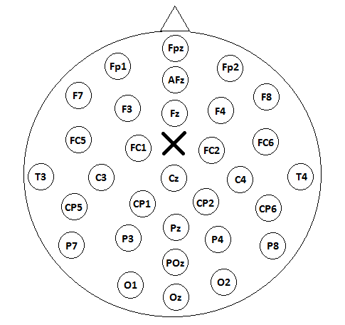

# TMS-EEG

## Introduction

The experiment is the same described in [Busan et al. 2019](https://doi.org/10.1016/j.clinph.2018.10.005), while the analyses replicate the method of [Gastaldon et al. 2023](https://doi.org/10.1093/cercor/bhad004).

## Method

### Acquisition

Data have been acquired from 28 subjects:
- 13 stuttering subjects
- 15 fluent speakers

The acquisition system was EBNeuro Mizar, and sampling rate was set to 4096Hz.

The EEG was acquired from 31 electrodes in the standard 10-20 position, ground electrode below Oz, reference electrode on the nose

### EEG Preprocessing

Preprocessing was done with EEGLAB

1. Data have been epoched from -200ms to 500ms locked to single pulse TMS delivered on SMA “complex” (-10 to +20/35 ms “lost” for TMS artifact)
2. Data have been cleaned from artifacts, and some epochs have been discarded (different number of epochs between baseline and TEP conditions)
3. Lowpass filter with cutoff frequency at 200Hz. TEPs data were averaged in every condition, also using linear detrend for remaining TMS artifacts

### BIDS Data structure

After the preprocessing data have been exported in bids format.

Each subject has been anonymized using a label:

- `S1xy` for stuttering subjects
- `S2xy` for healthy subjects

Data have been divided in two segments:

- `run-1` the baseline from -200ms to -10ms before the TMS pulse
- `run-2` the TEP from 20ms to 500ms after the TMS pulse

For each subject there are two different sessions:

- `task-Sham` the sham session
- `task-TMS` the real TMS session

To summarize, for each subject there are 4 files:

- `sub-S1xy_task-Sham_run-1_eeg`
- `sub-S1xy_task-Sham_run-2_eeg`
- `sub-S1xy_task-TMS_run-1_eeg`
- `sub-S1xy_task-TMS_run-2_eeg`

### Neural sources

The data have been analyzed using Brainstorm (the code in this repository!)

Here the steps:

1. Import BIDS folder
2. Head model
    1. Use template anatomy ICBM152
    2. Project electrodes on the scalp
    3. Compute head model for first subject
    4. Copy head model to all other subjects
3. Noise covariance matrix
    1. Compute noise covariance matrix on baseline
    2. Copy the covariance matrix on the corresponding TEP file
4. Source estimation
    1. Compute sources with sLoreta
5. Time series at ROI level
    1. Add the custom atlas `Data/atlas/scout_DS_Linguistic.mat` to anatomy (done manually in Brainstorm)
    2. Extract time series at ROI level using PCA
6. Time-frequency decomposition
    1. Morlet wavelets, between 8-30Hz
7. Event related sync/desync
    1. ERSD method using TEP file (`run-2`) as data and BL file(`run-1`) as baseline

